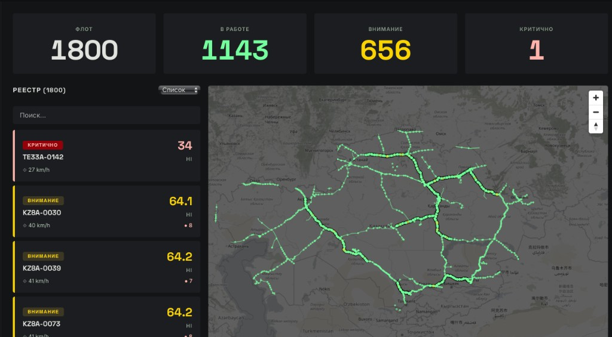
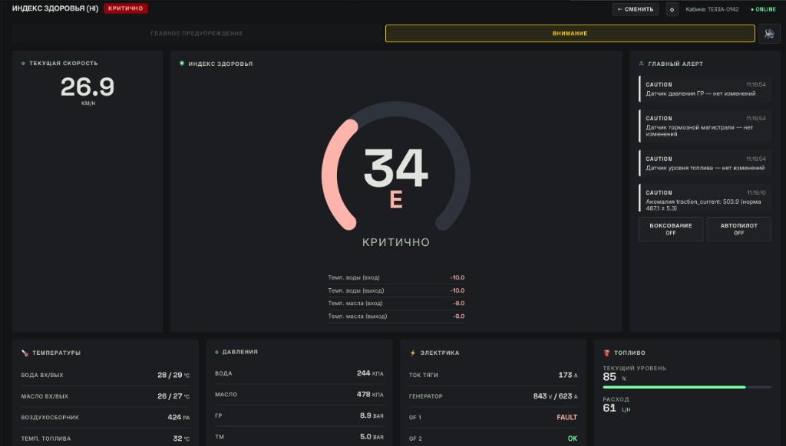

# LCAS — Locomotive Crew Alerting System

Система мониторинга и оповещения экипажа локомотива в реальном времени. Поддерживает **1700+ локомотивов** одновременно с микросервисной архитектурой.

### Диспетчерская — 1800 локомотивов на карте


### Кабина машиниста — каскадный аварийный сценарий (HI = 34, категория E)


## Быстрый старт (1 команда)

```bash
git clone https://github.com/Yessirkegen/LCAS.git
cd LCAS
make dev
```

Дождитесь запуска (~60 сек), затем откройте:

| Ресурс | URL |
|--------|-----|
| **Фронтенд** | http://localhost:3001 |
| **API** | http://localhost:8000/health |
| **Swagger** | http://localhost:8000/docs |

### Учётные данные

| Роль | Логин | Пароль |
|------|-------|--------|
| Машинист | `driver` | `driver123` |
| Диспетчер | `dispatcher` | `dispatcher123` |
| Админ | `admin` | `admin123` |

### Запуск симулятора

После входа запустите симулятор через API:

```bash
# 1 локомотив (для тестирования)
curl -X POST "http://localhost:8000/simulator/start"

# 10 локомотивов
curl -X POST "http://localhost:8000/simulator/start?count=10&hz=1"

# 1700 локомотивов (полная нагрузка)
curl -X POST "http://localhost:8000/simulator/start?count=1700&hz=1"

# Электровоз KZ8A
curl -X POST "http://localhost:8000/simulator/start?count=5&hz=1&loco_type=KZ8A"

# Аварийный сценарий (каскад: масло → вода → замыкание)
curl -X POST "http://localhost:8000/simulator/scenario?locomotive_id=TE33A-0001&scenario=cascade&duration_seconds=60"
```

## Требования

- **Docker** и **Docker Compose** v2
- **Порты**: 3001 (frontend), 8000 (nginx/api), 5433 (postgres), 6380 (redis), 9092 (kafka)

## Архитектура

```
                    ┌──────────────────────────────────────────┐
                    │              Nginx (LB :8000)            │
                    └──┬──────┬──────┬──────┬─────────────────┘
                       │      │      │      │
              ┌────────┘  ┌───┘  ┌───┘  ┌───┘
              ▼           ▼      ▼      ▼
        ┌──────────┐ ┌────────┐ ┌────┐ ┌──────────┐
        │Ingestion │ │  API   │ │ WS │ │Simulator │
        │   x3     │ │  x3   │ │ x4 │ │   x1     │
        └────┬─────┘ └───┬────┘ └─┬──┘ └────┬─────┘
             │            │       │          │
             ▼            │       │          │
     ┌───────────────┐    │       │          │
     │ Kafka (16 pt) │◄───┼───────┼──────────┘
     └───────┬───────┘    │       │
             │            │       │
             ▼            │       ▼
     ┌───────────────┐    │  ┌─────────┐
     │ Processor x8  │────┼─►│  Redis  │
     │ (HI, alerts)  │    │  └─────────┘
     └───────┬───────┘    │
             │            │
             ▼            ▼
     ┌───────────────────────┐
     │  TimescaleDB (Postgres)│
     └───────────────────────┘
```

**25 контейнеров** в production:

| Сервис | Инстансов | Назначение |
|--------|:---------:|------------|
| svc-ingestion | 3 | HTTP-приём телеметрии → Kafka |
| svc-processor | 8 | Kafka consumer: HI, алерты, аномалии → Redis + DB |
| svc-api | 3 | REST API: флот, история, admin |
| svc-ws-gateway | 4 | WebSocket: реалтайм через Redis pub/sub |
| svc-simulator | 1 | Генерация телеметрии 1700 лок → Kafka |
| nginx | 1 | Reverse proxy, load balancing |
| kafka | 1 | 16 партиций, consumer group |
| redis | 1 | Состояние, pub/sub, rate limiting |
| postgres | 1 | TimescaleDB, гипертаблицы |
| frontend | 1 | React, Vite, MapLibre, ECharts, Three.js |

## Формула Health Index (HI)

Health Index — единое число **0–100**, отражающее техническое состояние локомотива. Считается в реальном времени на каждый пакет телеметрии.

### 1. Оценка каждого параметра (Score)

Каждый параметр (температура воды, давление масла и т.д.) оценивается от 0 до 100 по 6-зонной шкале:

```
    0          50         100         50          0
    ├──────────┼──────────┼───────────┼──────────┤
  crit_min  warn_min  norm_min   norm_max  warn_max  crit_max
```

- **Норма** (`norm_min ≤ value ≤ norm_max`): Score = **100**
- **Предупреждение** (`warn ≤ value < norm`): Score = **50–100** (линейная интерполяция)
- **Критическая** (`crit ≤ value < warn`): Score = **0–50** (линейная интерполяция)
- **За пределами** (`value > crit_max` или `value < crit_min`): Score = **0**

### 2. Взвешенная сумма

```
HI_raw = Σ (weight_i × score_i) / Σ weight_i
```

Веса отражают критичность параметра (из интервью с машинистами ТЭ33А):

| Параметр | Вес |
|----------|:---:|
| Темп. воды (вход/выход) | 0.10 + 0.10 |
| Темп. масла (вход/выход) | 0.08 + 0.08 |
| Давление масла | 0.08 |
| Расход воздуха | 0.08 |
| Давление ГР | 0.08 |
| Тормозная магистраль | 0.08 |
| Скорость | 0.07 |
| Давление воды | 0.06 |
| Ток тяги | 0.05 |
| Уровень топлива | 0.05 |
| Давление воздуха | 0.04 |
| Темп. коллектора | 0.03 |
| Темп. топлива | 0.02 |
| **Итого** | **1.00** |

### 3. Бинарные штрафы

Аварийные события дополнительно снижают HI:

| Событие | Штраф |
|---------|:-----:|
| Замыкание на землю (силовые) | **−30** |
| Замыкание на землю (вспом.) | **−20** |
| Боксование | **−10** |

### 4. Итоговая формула

```
HI = clamp(0, 100, HI_raw + Σ penalties)
```

### 5. Категория и буква

| HI | Буква | Категория | Цвет |
|:--:|:-----:|-----------|------|
| 90–100 | **A** | normal | Зелёный |
| 80–89 | **B** | normal | Зелёный |
| 60–79 | **C** | attention | Жёлтый |
| 50–59 | **D** | attention | Жёлтый |
| 0–49 | **E** | critical | Красный |

### 6. Предиктивная модель

Линейная экстраполяция HI за последние 5 минут:

```
slope = (HI_now − HI_5min_ago) / Δt
minutes_to_critical = (50 − HI_now) / slope
```

Если `slope < 0` и `minutes_to_critical < 15` — отображается прогноз.

### 7. Дополнительные модули

- **EMA-сглаживание** (α = 0.3) — фильтрация шума перед расчётом
- **Аномалии** — z-score (μ ± 3σ) за последний час, 8 параметров
- **Stuck-датчики** — variance < 0.01 за 120 сек → CAUTION
- **Топливная эффективность** — сравнение с флотом при сходной скорости
- **Data Quality** — доля null/spike значений по каждому параметру

## Ключевые функции

### Кабина машиниста
- **Health Index** (0–100) — взвешенная оценка по всем параметрам
- **LCAS-оповещения** — CAUTION / WARNING / голосовое TTS / полноэкранный оверлей
- **Тренды** — ECharts графики параметров в реальном времени
- **3D-модель** — визуализация локомотива (TE33A / KZ8A)
- **Горячие клавиши**: Пробел (подтвердить алерт), D (тема), M (звук)

### Диспетчерская
- **Карта** — 1700 точек на MapLibre (GPU-рендеринг)
- **Heatmap** — визуализация флота одним взглядом (Canvas)
- **Фильтрация** — по статусу, поиск по номеру

### Два типа тяги
- **TE33A** — дизельный (температуры воды/масла, давления, генератор)
- **KZ8A** — электровоз 25 кВ (пантограф, ТЭД, инвертор, рекуперация)

### Аварийные сценарии
```bash
# Перегрев воды
curl -X POST ".../simulator/scenario?scenario=overheat_water&duration_seconds=30"
# Перегрев масла
curl -X POST ".../simulator/scenario?scenario=overheat_oil&duration_seconds=30"
# Замыкание на землю
curl -X POST ".../simulator/scenario?scenario=ground_fault&duration_seconds=30"
# Каскадный отказ
curl -X POST ".../simulator/scenario?scenario=cascade&duration_seconds=60"
```

## Makefile

```bash
make dev              # Запустить всё
make down             # Остановить
make logs             # Все логи
make logs-processor   # Логи процессоров
make logs-simulator   # Логи симулятора
make ps               # Статус контейнеров
make clean            # Удалить всё включая данные
```

## Стек технологий

**Backend**: Python 3.12, FastAPI, aiokafka, SQLAlchemy, asyncpg, redis.asyncio, pydantic

**Frontend**: React 19, TypeScript, Vite, Zustand, MapLibre GL, ECharts, Three.js / R3F, i18next

**Инфраструктура**: Docker Compose, Nginx, Kafka, Redis, TimescaleDB/PostgreSQL

## API

| Метод | Путь | Описание |
|-------|------|----------|
| POST | `/api/auth/login` | Авторизация |
| GET | `/api/locomotives` | Список флота |
| GET | `/api/locomotives/{id}/state` | Текущее состояние |
| GET | `/api/locomotives/{id}/telemetry?minutes=5` | История телеметрии |
| GET | `/api/admin/thresholds` | Пороговые значения |
| GET | `/api/admin/system-status` | Статус системы |
| POST | `/simulator/start?count=N&loco_type=TE33A` | Запуск симулятора |
| POST | `/simulator/scenario?scenario=cascade` | Аварийный сценарий |
| WS | `/ws?token=JWT&loco_id=ID` | WebSocket телеметрия |

## Нагрузочное тестирование (RPS)

Результаты бенчмарка на **m6i.4xlarge** (16 vCPU, 64 GB RAM) при 1800 активных локомотивах:

| Эндпоинт | RPS | Latency (avg) | Concurrency | Failed |
|----------|:---:|:-------------:|:-----------:|:------:|
| `GET /health` | **6 162** | 8 ms | 50 | 0 |
| `POST /ingest/telemetry` | **4 749** | 6 ms | 30 | 0 |
| `GET /api/locomotives` (1800 locos) | 15 | 1 290 ms | 20 | 0 |

- **Ingestion**: 4 749 req/sec — в 2.8x больше чем нужно для 1700 лок на 1 Гц
- **Health check**: 6 162 req/sec — headroom для мониторинга
- **Fleet list**: тяжёлый запрос (1800 записей из Redis), но для диспетчера достаточно

### Throughput пайплайна

| Метрика | Значение |
|---------|----------|
| Kafka ingestion | **1 800 msg/sec** (sustained) |
| Kafka → Redis (processing) | **1 800 msg/sec** (8 consumers) |
| Redis pub/sub fan-out | **3 600 publish/sec** |
| TimescaleDB batch insert | **3 600 rows / 2 sec** |
| WebSocket delivery | **< 500 ms** end-to-end |

## Демо

**Live**: https://13-60-234-204.sslip.io

## Лицензия

MIT
